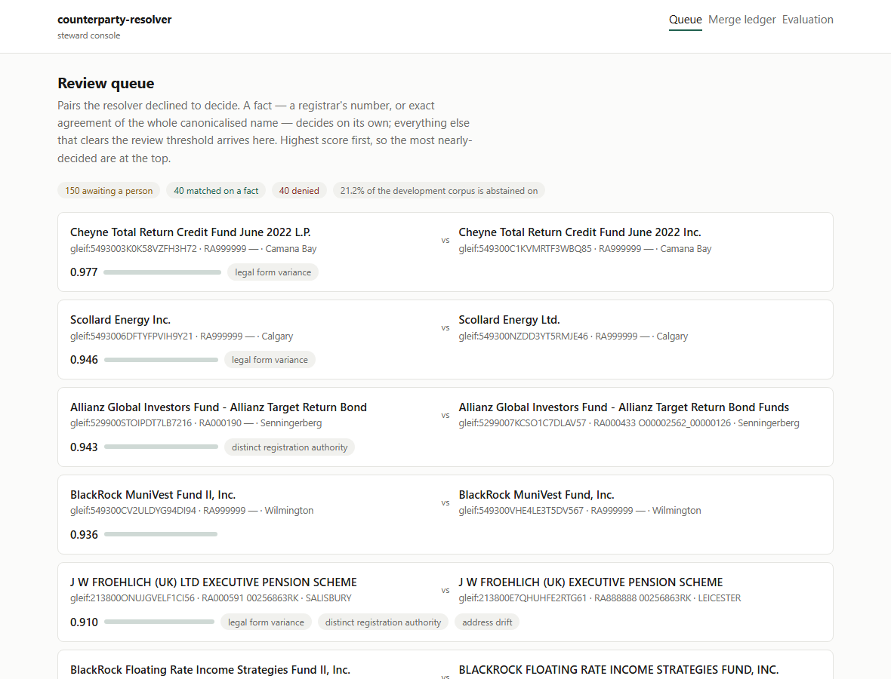
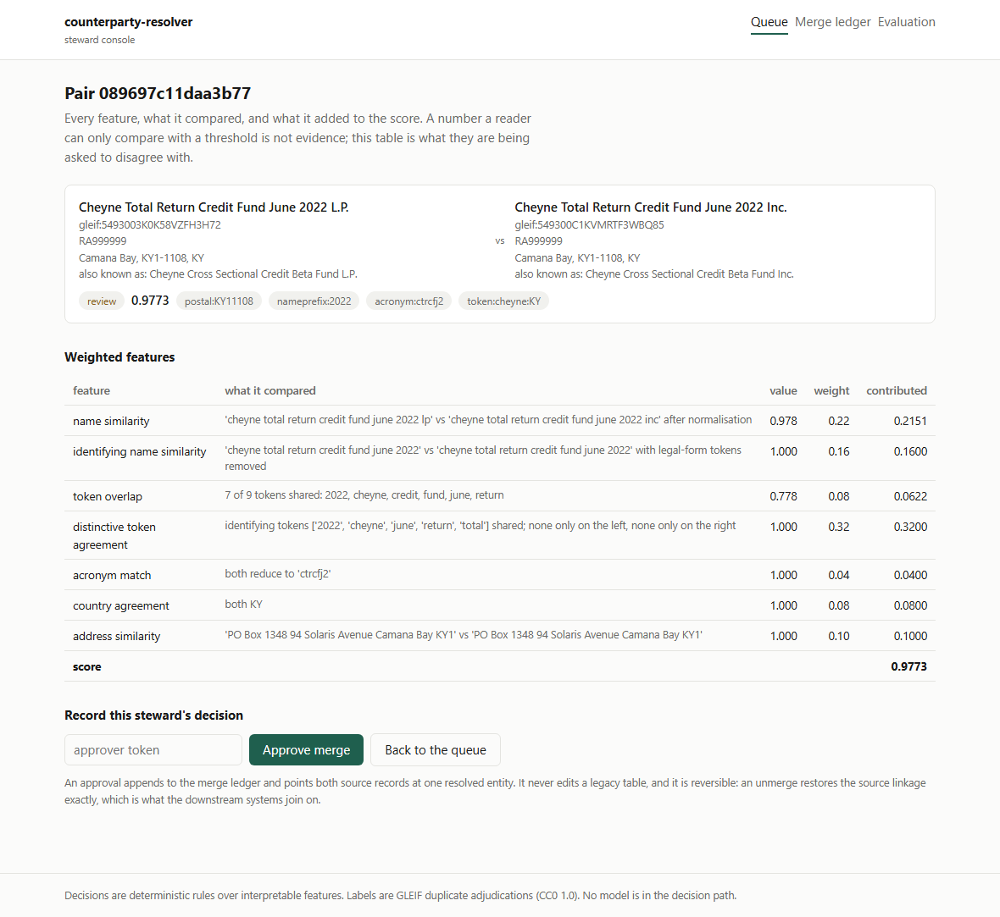
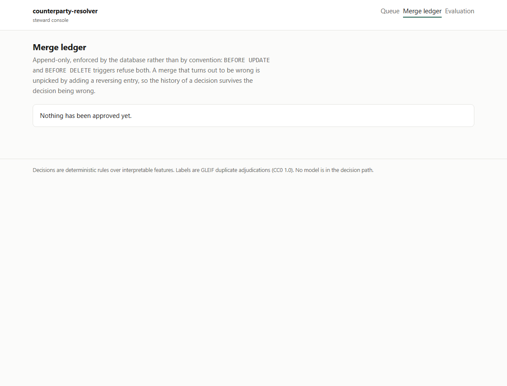
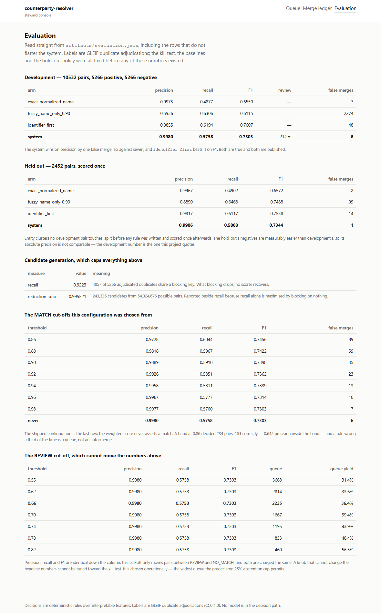

# counterparty-resolver

Decide whether two records refer to the same real-world counterparty, on labels a registrar wrote.

A resolution layer over two fixed source schemas. Deterministic rules over interpretable features
produce **MATCH**, **REVIEW** or **NO_MATCH**; a person approves every merge; and every merge is
reversible to the byte, including the source-system linkage that downstream systems join on.

**No model is in the decision path.** Not as a position — as a measurement. The evaluation below is
what deterministic rules over 12,984 registrar-adjudicated pairs actually achieve, and it is
published beside the three baselines it has to beat, including the one that beats it.

---

## The numbers

Labels are **GLEIF duplicate adjudications**: an LEI Issuing Organisation recorded one LEI as the
duplicate of another. They are not ours. The kill test, the baselines and the hold-out policy were
all fixed in [`DECISIONS.md`](DECISIONS.md) at commit `b620131`, **before the package existed**.

**12,984 labelled pairs over 12,853 records** — 6,492 registrar adjudications and 6,492
similarity-mined hard negatives — split into development and hold-out over entity clusters, not over
pairs, so no entity appears on both sides.

### Development — 10,532 pairs, 5,266 positive, 5,266 negative

| arm | precision | recall | F1 | review | false merges |
|---|---|---|---|---|---|
| `exact_normalized_name` | 0.9973 | 0.4877 | 0.6550 | — | 7 |
| `fuzzy_name_only_0.90` | 0.5936 | 0.6306 | 0.6115 | — | 2,274 |
| `identifier_first` | 0.9855 | 0.6194 | **0.7607** | — | 48 |
| **system** | **0.9980** | 0.5758 | 0.7303 | 21.2% | **6** |

### Held out — 2,452 pairs over entity clusters no development pair touches, scored once

| arm | precision | recall | F1 | false merges |
|---|---|---|---|---|
| `exact_normalized_name` | 0.9967 | 0.4902 | 0.6572 | 2 |
| `fuzzy_name_only_0.90` | 0.8890 | 0.6468 | 0.7488 | 99 |
| `identifier_first` | 0.9817 | 0.6117 | 0.7538 | 14 |
| **system** | **0.9986** | 0.5808 | 0.7344 | **1** |

**Development to hold-out, every metric moves by less than 0.005.** That is the number this project
is actually about. The seven feature weights were argued from the meaning of each feature before any
result existed and have not moved since; the two numbers chosen from a development curve are not
fits either — `THRESHOLD_MATCH` was set to `None`, which removes the band rather than tuning it, and
`THRESHOLD_NO_MATCH` provably cannot move precision, recall or F1, which the published sweep shows
as an identical row repeated down the whole column.

**One thing does cross the split, and it is priced rather than argued about.** The document-frequency
tables behind `distinctive_token_agreement` and the identifier-distinctiveness guard are computed
over every record in the corpus, held-out records included. No label is involved, so it is not label
leakage — but it is information from the held-out records reaching their own scoring:

| | development precision | hold-out precision | hold-out false merges |
|---|---|---|---|
| corpus-wide priors (the rows above) | 0.9980 | 0.9986 | 1 |
| development-only priors | 0.9977 | 0.9972 | 2 |

Both arms are computed by `make evaluate-holdout` and published under `prior_sensitivity`. **0.9972
is the floor**, the kill test passes under either, and a reader who considers corpus-wide priors a
leak should read the second row.

### Three things this table says that are not flattering, and are not hidden

- **`identifier_first` beats the system on F1**, 0.7607 against 0.7303. The kill test was
  predeclared on precision, the system wins there — six false merges against forty-eight — and it
  does not win on the aggregate.
- **The margin on precision is one false merge.** 0.9980 against 0.9973 is six against seven. Nobody
  should read that as a comfortable win.
- **The hold-out's negatives are easier than development's** — mean name similarity 0.8147 against
  0.9037 — so its absolute precision is not comparable to development's. The development number is
  the one quoted everywhere in this repository.
- **`fuzzy_name_only_0.90` is scored by a corpus selected against it.** Hard negatives are ranked by
  Jaro-Winkler over normalised names, which is exactly that baseline's decision function, so the
  miner is its adversary by construction — which is what its 0.5936 against 0.8890 across the two
  splits is showing. The kill test turns on `identifier_first`, which the mining metric does not
  touch, so the criterion is unaffected; but that row is not a fair measurement.

### Candidate generation, which caps everything above

| | |
|---|---|
| recall | **0.9138** — 4,812 of 5,266 adjudicated duplicates are actually emitted as candidates |
| dropped by the block-size ceiling | 45 — pairs that share a key and are still never generated |
| reduction ratio | 0.995521 — 243,336 candidates from 54,324,676 possible pairs, over 10,424 records |

Reported on its own because a resolver cannot recover a true match blocking never surfaced. The
reduction ratio is beside it because recall alone is trivially maximised by blocking on nothing.

Recall here is measured against **what `candidate_pairs` emits**, not against whether two records
share a key. Those are different questions — `blocking.py` skips any block over `MAX_BLOCK_SIZE` —
and the looser one reports 0.9223. Reporting it would be counting 45 pairs as surfaced that the
system never generates.

**The record pool is not a counterparty master.** Every one of those 10,424 records participates in
an adjudicated duplicate, because the corpus is built from GLEIF's `DUPLICATE` records and their
successors. The reduction ratio is therefore measured over a pool already filtered to duplicates,
and is not the number the same blocking would achieve over a real master file.

---

## How a decision is made

The order is the design. **What a registrar wrote down is read first; what two strings look like is
read afterwards.**

1. **The registrar's number.** Same authority, same `registeredAs` → MATCH. Same authority,
   different numbers → NO_MATCH, however identical the names are.
2. **A differing series, class or vintage designator.** `Target Retirement 2027` against
   `Target Retirement 2037` is two products; the strings are 95% identical and a similarity average
   cannot see the year.
3. **Exact agreement of the whole canonicalised name**, legal form included → MATCH.
4. **A weighted sum over seven interpretable features**, which decides **REVIEW or NO_MATCH** and
   never MATCH.

Two of those deserve their own sentence, and one absence does.

**Identifier agreement is only a fact when the identifier identifies.** Every Allianz fund at
RA000665 carries the same `registeredAs`, so the rule asserted that a small-cap equity fund and a
bond fund were one company — 40 false merges. Agreement now requires the number to appear on at most
two records corpus-wide, which is what a duplicate and its successor look like.

**Prior names are carried and never consulted.** The crosswalk unpivots Companies House's ten
`previous_name_*` columns and GLEIF's `otherNames` array into one shape, and the console renders
them — but no feature and no hard signal reads `other_names`. That is a real gap rather than a
design choice: of the 2,234 development positives the system does not match, **324 have an exact
normalised alias match**, against one such collision across all 5,266 negatives. Using it is a rule
change against a spent hold-out, so it is the first thing the next corpus buys.

**The weighted score never asserts a match**, and that is a measurement rather than a stance. A
MATCH band at 0.86 decided 234 development pairs, 151 correctly and 83 wrongly — 0.645 precision
inside the band. A rule wrong a third of the time is a queue, not an auto-merge. Removing the band
costs 0.029 recall and removes 83 of 89 false merges. The whole sweep is published in
`artifacts/evaluation.json` under `operating_points`, so the choice is auditable and arguable.

---

## The steward console

Four screens, served by FastAPI. **Read-only unless `CR_APPROVER_TOKEN` is set**, and it fails
closed: a missing token means the write endpoints return 403, not merely that a button is greyed.

| | |
|---|---|
|  |  |
| **Review queue** — what the resolver declined to decide, highest score first | **Pair** — every feature, what it compared, and what it contributed |
|  |  |
| **Merge ledger** — append-only, with the reversal of any merge | **Evaluation** — the published numbers, including the unflattering rows |

Regenerate them with `uv run python scripts/screenshots.py`, which starts the server, drives a
headless browser and writes both themes. A screenshot nobody can reproduce is a claim about a UI
that may no longer exist.

---

## The brownfield constraint

The two source schemas are **fixed and may not be altered**, so everything this project owns is
additive. That is the constraint a mid-level engineer actually works under, and here it is
enforceable rather than promised: a migration naming a legacy table is refused before it runs, and
`tests/test_store.py` fails the build over the committed migration list.

- `legacy_gleif` keeps prior names as a typed, unbounded array.
- `legacy_companies_house` keeps them as **ten numbered columns**, because its CSV header reads
  `Previous Names (occurs max 10)`. One models a list; the other models a spreadsheet.
- A **view** reconciles them. The join key is `registered_at = 'RA000585'` plus `registered_as`,
  which is a convention discovered in the data — 111,717 LEI records carry it — not a foreign key
  anybody declared.

### The merge ledger

- **Append-only in the database**, not by convention: `BEFORE UPDATE` and `BEFORE DELETE` triggers
  refuse both. A merge that turns out to be wrong is unpicked by adding a reversing entry.
- **Idempotent** on a UNIQUE key, so a retry after a timeout is safe and a double-click is one merge.
- **Reversible, including source-system linkage.** The unmerge test compares a full snapshot of
  every table taken before the merge against the state after the reversal. Asserting that the
  resolved entity disappeared would pass against an implementation that left `source_link` rows
  pointing nowhere, which is the failure that costs money.

### Expand / contract

The `approved_by` → `approver_id` rename runs as three deployable steps, because a single `ALTER` is
only safe if the database and every process change in the same instant, and deploys are rolling.

| version | phase | what it does |
|---|---|---|
| 2 | expand | add `approver_id`, nullable. Old code ignores it; new code can read either. |
| 3 | transition | backfill. Both columns are present, so a rollback is a deploy. |
| 4 | contract | drop `approved_by` — **refused while any row would lose its approver**. |

That refusal is the point. Old code deployed before the expand can still insert a row carrying
`approved_by` alone *between* steps 3 and 4, and dropping the column then would destroy the only
record of who approved that merge.

---

## Run it

```bash
uv sync
uv run python -m pytest                          # 132 tests, no network
uv run uvicorn counterparty_resolver.api.app:app # read-only console on :8000
CR_APPROVER_TOKEN=$(openssl rand -hex 16) uv run uvicorn counterparty_resolver.api.app:app
```

Rebuild the evidence from source (needs network; ~65 requests to GLEIF):

```bash
make corpus      # fetch adjudications, mine hard negatives, write artifacts/corpus.json
make holdout     # freeze the split -- commit this before scoring anything
make evaluate    # development only
make demo        # the console's dataset, development split only
```

`make evaluate-holdout` spends the hold-out. It is behind its own target because scoring it is a
one-way door: ADR-001 fixes that no rule, threshold, feature or normalisation changes afterwards.

---

## Data, licences, and what is not redistributed

| source | licence | how it is used |
|---|---|---|
| [GLEIF LEI (Level 1)](https://www.gleif.org/en/lei-data/gleif-golden-copy) | **CC0 1.0** | Labels and records. Derived pairs are committed in `artifacts/`; CC0 permits it. |
| [Companies House Free Company Data](https://download.companieshouse.gov.uk/en_output.html) | **OGL v3** | The second legacy **schema**. No extract is vendored or fetched. |
| OpenSanctions Pairs | CC BY-NC 4.0 | **Not used.** The dataset no longer exists — see below. |

Raw fetched records are cached under `data/`, which `.gitignore` excludes, so re-running is cheap and
no source payload reaches git by accident. Full provenance:
[`docs/DATA_PROVENANCE.md`](docs/DATA_PROVENANCE.md).

**The external baseline is gone.** `PORTFOLIO_BLUEPRINT.md` planned to anchor these numbers against
OpenSanctions Pairs and its published 91.33% F1 rule-based baseline. Every URL for that dataset now
returns 404 and the live index lists 479 datasets, none of them pairs-like (verified 2026-09-24). So
this project's numbers are **externally labelled but not externally comparable**, and no sentence
here implies otherwise.

---

## The ceiling nothing here can lift

Negatives are the most name-similar pairs GLEIF has *not* linked, which selects precisely for
duplicates nobody has adjudicated yet. `TIFFANY AND COMPANY` at RA000628 against `TIFFANY & CO.` at
RA000602 is labelled a negative and is almost certainly one company. Every arm is charged for these,
and arms that decide more are charged more. **Published precision is a floor, not an estimate.**

Three adversarial cases are published as **characterised misses**, marked `known_limitation` in
[`tests/adversarial_cases.json`](tests/adversarial_cases.json) — most notably `IBM` against
`International Business Machines`, which the resolver denies at 0.389. Their `expect` field records
what the resolver *does*, not what a person would want, so the suite is green on them and the file
says why. The hold-out was scored at `b67b83e` and ADR-001 forbids changing a rule afterwards, so
they are documented rather than fixed.

---

## Not built

Recorded so it cannot look like an omission discovered later. `PORTFOLIO_BLUEPRINT.md` specifies
~9 sessions; this increment is a 1–2 day fast-track.

| blueprint item | status |
|---|---|
| pgvector + embedding candidate generation | Not built. Deterministic blocking instead, and its recall is published as a kill criterion rather than assumed. |
| Redis blocking keys / candidate cache | Not built. |
| Live LLM adjudication of the ambiguity band | Not built. The band is measured — 21.2% of development, 36.4% of it genuine duplicates — but the second arm is not run, so no cost-per-1,000-pairs comparison is published. |
| React steward console | Replaced by server-rendered HTML. A build step and a bundler would not make the evidence on screen more legible. |
| PostgreSQL | SQLite. The blueprint's own constraint for this increment is no Postgres where files suffice, and the resolution layer is one process with one writer. |

---

## Every number here is checked against the artifact

`tests/test_published_numbers.py` parses the result tables above and fails the build when a cell
disagrees with `artifacts/evaluation.json`. It exists because a README is the one surface in this
repository that was a promise rather than a mechanism, and two reviews found four stale or
overstated claims there while finding none in the code's guarantees. `DECISIONS.md` ADR-004 lists
all of them.

## Layout

```
src/counterparty_resolver/
  normalize.py    canonicalisation: legal forms, accents, identifiers
  blocking.py     five deterministic key families, and the block-size ceiling
  features.py     seven interpretable features, and the hard signals that are not features
  resolve.py      the three bands, and the order facts are read in
  evaluate.py     precision/recall with abstention priced, three baselines, the sweeps
  corpus/         GLEIF acquisition, hard-negative mining, the group-aware split
  store/          two fixed legacy schemas, migrations, crosswalk views, the merge ledger
  api/            the steward console
artifacts/        corpus, split, evaluation, demo -- the evidence, committed
tests/            kill criteria, pre-declaration guards, unit tests, 18 adversarial cases
DECISIONS.md      ADR-001 (before implementation), ADR-002, ADR-003 (the hold-out)
```

Read `DECISIONS.md` first if you only read one file. It contains the claim, the corpus contract, the
baselines and the kill test — all written down before any of them could be influenced by a result —
and then what the data did to them.
